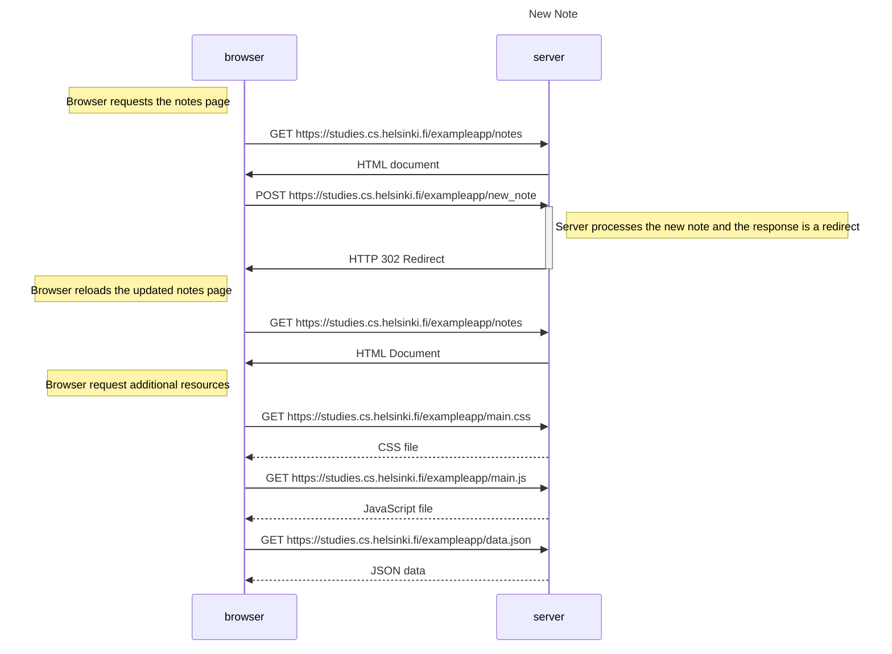

```mermaid
sequenceDiagram
    title New Note
    participant browser
    participant server

    Note left of browser: Browser requests the notes page
    browser->> server: GET https://studies.cs.helsinki.fi/exampleapp/notes
    server->> browser: HTML document

    browser->> server: POST https://studies.cs.helsinki.fi/exampleapp/new_note
    activate server
    Note right of server: Server processes the new note and the response is a redirect
    server->> browser: HTTP 302 Redirect
    deactivate server

    Note left of browser: Browser reloads the updated notes page
    browser->> server: GET https://studies.cs.helsinki.fi/exampleapp/notes
    server->> browser: HTML Document

    Note left of browser: Browser request additional resources
    browser->> server: GET https://studies.cs.helsinki.fi/exampleapp/main.css
    server-->>browser: CSS file
    browser->> server: GET https://studies.cs.helsinki.fi/exampleapp/main.js
    server-->>browser: JavaScript file
    browser->> server: GET https://studies.cs.helsinki.fi/exampleapp/data.json
    server-->>browser: JSON data
```