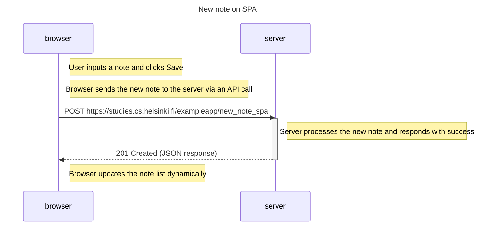

```mermaid
sequenceDiagram
    title New note on SPA
    participant browser
    participant server

    Note right of browser: User inputs a note and clicks Save

    Note right of browser: Browser sends the new note to the server via an API call
    browser->> server: POST https://studies.cs.helsinki.fi/exampleapp/new_note_spa
    activate server
    Note right of server: Server processes the new note and responds with success
    server-->>browser: 201 Created (JSON response)
    deactivate server

    Note right of browser: Browser updates the note list dynamically
```